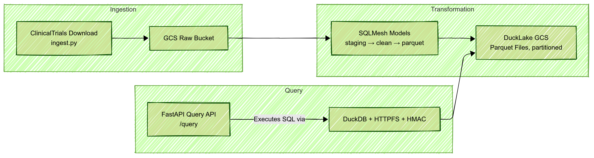

# Clinical Trials Data Platform on GCP

This repository implements a complete, automated data platform for querying clinical trial data on Google Cloud Platform (GCP). It covers:

* **Infrastructure as Code** with Terraform
* **Data Ingestion** via Python (`ingest.py`)
* **Data Transformation** using SQLMesh & DuckDB
* **Query API** built with FastAPI & DuckDB
* **CI/CD Pipeline** with GitHub Actions

---

## Architecture



* **ingest.py** downloads JSON ZIP from ClinicalTrials.gov and uploads raw JSON to `raw` GCS bucket.
* **SQLMesh** reads raw JSON via DuckDB's HTTPFS, cleans & normalizes fields, and exports Parquet to `ducklake` bucket.
* **FastAPI** serves a `/query` endpoint that runs arbitrary `SELECT` SQL against the Parquet files via DuckDB.
* **Terraform** provisions GCS buckets, Artifact Registry, Cloud Run service, and IAM.
* **GitHub Actions** lint, test, plan/apply Terraform, build/push Docker image, and deploy Cloud Run.

---

## Prerequisites

1. **GCP Project** with billing enabled
2. **APIs Enabled**:

   * Cloud Storage (`storage.googleapis.com`)
   * Artifact Registry (`artifactregistry.googleapis.com`)
   * Cloud Run (`run.googleapis.com`)
3. **Service Account** JSON with:

   * `roles/storage.admin` (for Terraform state & bucket creation)
   * `roles/artifactregistry.admin`
   * `roles/run.admin`
   * `roles/iam.serviceAccountAdmin`
4. **Local Tools**:

   * Terraform v1.5+
   * Python 3.11
   * Docker & `gcloud` CLI

---

## Setup

1. **Clone the repo**

   ```bash
   git clone https://github.com/your-user/your-repo.git
   cd your-repo
   ```

2. **Create & activate virtualenv**

   ```bash
   python3 -m venv venv
   source venv/bin/activate
   ```

3. **Install Python deps**

   ```bash
   pip install -r requirements.txt
   pip install -r requirements-dev.txt
   ```

4. **Configure `.env`** (in repo root)

   ```ini
   GOOGLE_APPLICATION_CREDENTIALS=/path/to/sa-key.json
   RAW_BUCKET=your-name-clinical-trials-raw
   DUCKLAKE_BUCKET=your-name-clinical-trials-ducklake
   GCS_HMAC_KEY_ID=...
   GCS_HMAC_SECRET=...
   ```

---

## Terraform

1. **Bootstrap remote state** (manual step)

   ```bash
   gcloud storage buckets create gs://your-terraform-state \
     --location=us-central1 --uniform-bucket-level-access
   ```

2. **Initialize & plan**

   ```bash
   cd Terraform
   terraform init \
     -backend-config="bucket=your-terraform-state" \
     -backend-config="prefix=clinical-trials/state"
   terraform fmt -check
   terraform validate
   terraform plan -out=tfplan
   ```

3. **Apply**

   ```bash
   terraform apply -auto-approve tfplan
   ```

Outputs include bucket names and Cloud Run URL.

---

## Data Ingestion & Transformation

1. **Ingest raw JSON**

   ```bash
   python ingest.py
   ```

   This writes `clinical_trials.json` to `gs://$RAW_BUCKET`.

2. **Run SQLMesh pipeline**

   ```bash
   cd sqlmesh_project
   sqlmesh plan --environment dev
   sqlmesh apply --environment dev
   ```

   Models:

   * `raw.clinical_trials`: VIEW on JSON
   * `curated.clinical_trials_clean`: cleaned table
   * `curated.clinical_trials`: Parquet export

---

## API

1. **Run locally**

   ```bash
   uvicorn main:app --reload --host 0.0.0.0 --port 8080
   ```

2. **Docker**

   ```bash
   cd api
   docker build -t clinical-query-api .
   docker run -p 8080:8080 \
     -e GCS_HMAC_KEY_ID=$GCS_HMAC_KEY_ID \
     -e GCS_HMAC_SECRET=$GCS_HMAC_SECRET \
     -e DUCKLAKE_BUCKET=$DUCKLAKE_BUCKET \
     clinical-query-api
   ```

3. **Query**

   ```bash
   curl -X POST http://localhost:8080/query \
     -H "Content-Type: application/json" \
     -d '{"sql":"SELECT NCTId, BriefTitle FROM ducklake LIMIT 5"}'
   ```

---

## CI/CD

The GitHub Actions workflow in `.github/workflows/ci-cd.yml` performs:

1. **Lint & Test Python**: Flake8, Black, isort, pytest
2. **SQLMesh Tests**: `sqlmesh test --environment dev`
3. **Terraform**: fmt, init, validate, plan (with backend config)
4. **Build & Push**: Docker image to Artifact Registry
5. **Deploy**: `terraform apply` + `gcloud run deploy`

Ensure repository secrets are set for GCP credentials, project, region, bucket names, and image names.

---

## Contact & Contributing

For questions or improvements, please open an issue or pull request on the repository.
